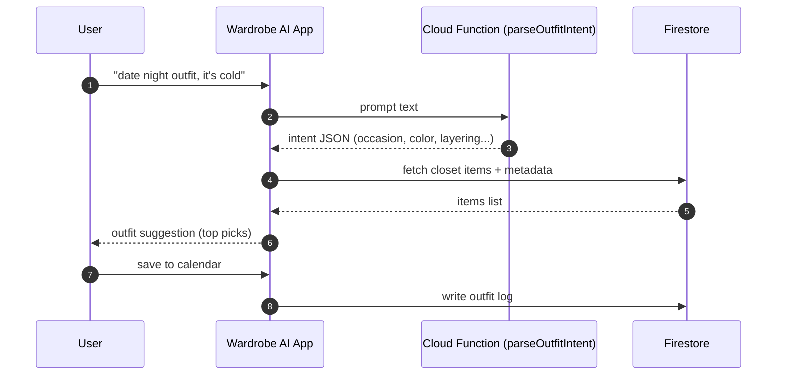
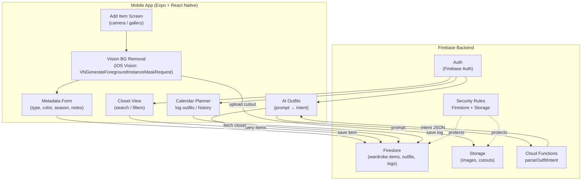

# Wardrobe AI

**Wardrobe AI** is an AI-powered mobile application that helps users digitize their wardrobe and receive outfit recommendations based on their clothing inventory, occasion, and context.

The app combines **computer vision, mobile development, and AI intent parsing** to create a personal styling assistant that suggests outfits directly from a user's closet.

---

## Demo

**

Example flow:

1. User adds clothing items by taking photos  
2. Background is automatically removed using iOS Vision  
3. Items are stored in a digital wardrobe  
4. User can ask the AI for outfit suggestions  
5. Suggested outfits are logged into a calendar planner  

---

## Features

### Digital Wardrobe
- Add clothing items with photos
- Store and organize wardrobe items
- Filter and search clothing

### AI Outfit Suggestions
- Parse user prompts such as  
  `"suggest a work outfit"`
- Convert natural language into structured outfit intent
- Generate outfit suggestions from the user's closet


---

## AI Outfit Suggestion Pipeline


**Key engineering notes**
- On-device segmentation keeps photos private and reduces server cost.
- Firebase rules enforce user-scoped access (`users/{uid}/...`).
- Cloud Function converts free-text to structured intent for deterministic outfit logic.
- 
### Clothing Image Processing
- Background removal using **Apple Vision Framework**
- Clean segmentation of clothing items

### Outfit Planner
- Calendar-based outfit logging
- Track previously worn outfits

### Secure Cloud Backend
- Firebase Authentication
- Firestore database
- Secure storage rules

---

## Tech Stack

### Mobile
- React Native
- Expo
- TypeScript
- Expo Router

### Backend
- Firebase Authentication
- Firestore
- Firebase Cloud Functions
- Firebase Storage

### AI / Vision
- iOS Vision Framework (`VNGenerateForegroundInstanceMaskRequest`)
- AI intent parsing for outfit requests

---
## System Architecture



## Architecture Overview

User Flow

```
User Photo
      ↓
Vision Framework (Background Removal)
      ↓
Clothing Item Stored in Firestore
      ↓
User Prompt → AI Intent Parser
      ↓
Outfit Generator
      ↓
Suggested Outfit
```

---

## Project Structure

```
app/
  (tabs)/
    add/
    closet/
    today/

components/
hooks/
constants/
scripts/

firebase rules/
firestore indexes
```

The project uses a **modular architecture** to separate UI components, business logic, and backend integration.

---

## Getting Started

### Install Dependencies

```
npm install
```

### Run the App

```
npx expo start
```

Then open the project using:

- iOS Simulator
- Android Emulator
- Expo Go

---

## Environment Setup

This project requires Firebase configuration.

Create environment variables for:

```
FIREBASE_API_KEY
FIREBASE_AUTH_DOMAIN
FIREBASE_PROJECT_ID
FIREBASE_STORAGE_BUCKET
FIREBASE_MESSAGING_SENDER_ID
FIREBASE_APP_ID
```

---

## Roadmap

### V1
- Digital wardrobe inventory
- Clothing image segmentation
- AI outfit intent parsing
- Basic outfit suggestion engine
- Outfit planner calendar

### Future Features
- Automatic clothing metadata extraction
- Brand detection
- Weather-aware outfit suggestions
- Style learning AI
- Outfit visualization

---

## Why This Project

Most wardrobe apps only store clothing items.

**Wardrobe AI focuses on building an intelligent wardrobe assistant that understands context and generates outfit suggestions using AI.**

This project explores the intersection of:

- Mobile engineering
- Computer vision
- AI-powered user experiences

---

## Author

**Mir Athfan Ali**

Illinois Institute of Technology  
MAS Computer Science  

GitHub:  
https://github.com/mirathfan

---

## License

MIT License
